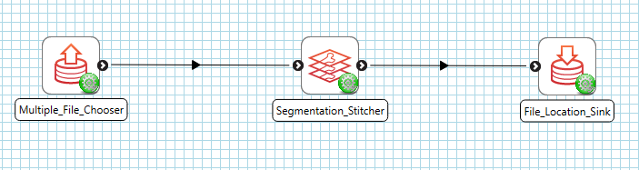
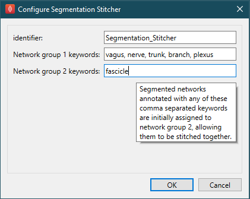
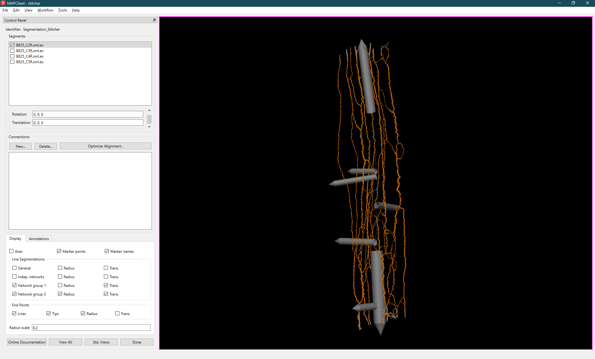
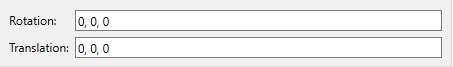
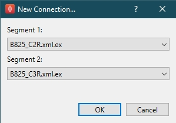
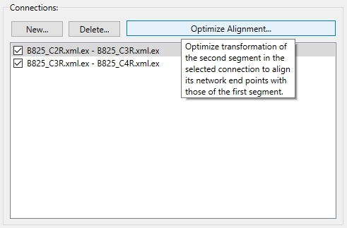
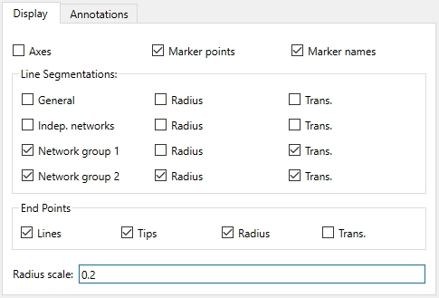
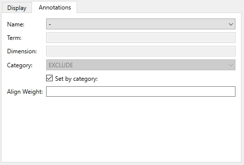
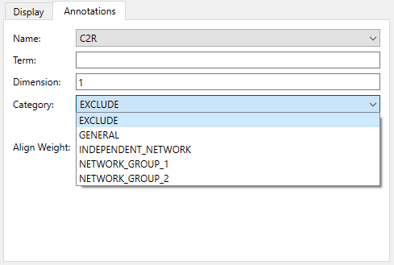

Segmentation Stitcher
=====================

Overview
--------

The **Segmentation Stitcher** tool provides an interface for stitching anatomical segmentations, 
enabling users to seamlessly combine multiple segmentation files into one file. 

This document describes how to set up and use the **Segmentation Stitcher** user interface in the Mapping Tools. 
The actual work is done by the underlying *segmentationstitcher* library which can run it without a user interface, 
together with the *Zinc library* which handles model representation and computation.

Workflow Connections
--------------------

The workflow connections for **Segmentation Stitcher** are shown in :numref:`fig-segmentation-stitcher-workflow`:

.. _fig-segmentation-stitcher-workflow:

   **Segmentation Stitcher** workflow connections.

The tool has 1 input on the left:

1. A list of *Zinc library* compatible EX file, use **Multiple_File_Chooser** to read from files.

It produces 1 outputs, which may be piped to other workflow steps:

1. A connected Zinc EX file.

Whether you use the output in a further workflow step or not, on completion of the workflow step the connected segmentation output is written to a file in the workflow 
folder under the same name as the step with extension ``.exf``.

Background
----------
The Segmentation Stitcher utilizes a network organization system that governs how different anatomical structures can connect. 
Understanding these connectivity rules is essential for effective segmentation stitching. 

There are five groups for connecting, each with distinct characteristics.
Upon initial execution, each mesh element is automatically assigned to a category based on predefined rules.
Users can later modify these assignments in the `Annotations`_ tab.

The Network groups 1 and 2, defined during the initial `Configure`_, serve as the core categories of the connection system. 
These groups typically separating main structures like nerve trunks and plexuses from smaller structures like fascicles, 
ensuring organized and controlled stitching within their respective domains. 
During configuration, users define keywords for each group, and networks matching these keywords are automatically assigned to the appropriate network group.

Graphics that not assigned to Network group 1 or 2, and has an anatomical term are automatically placed in the General group by the first run.
This category often serves as a default for segments that do not require specialized handling.
For example, graphics such as contours, which are not meant to connect with any other elements, can be included in the output but will not be stitched to anything else.

The Exclude category is reserved for graphics that should remain isolated from the connection process. 
These graphics are hidden from visualization to maintain workspace clarity and will not be exported in the final output. 
Initially, any network that does not matching the criteria for Network groups 1 or 2, and lacks an anatomical term is automatically placed in this category.

The Independent networks occupy a unique position in the system. These networks, which begin as an empty set by default, can only form connections with themselves.
This isolation makes them ideal for handling distinct anatomical structures that shouldn't intermingle with other networks.

Instructions
------------
Configure
^^^^^^^^^
The configuration dialog for **Segmentation Stitcher** allows you to set up network grouping:

.. _fig-configuration:

   **Segmentation Stitcher** step configuration dialog.

In the configuration dialog, you can:

1. Set a unique identifier for this step

2. Define keywords for network group 1 (typically for main structures like vagus, nerve, trunk, branch, plexus)

3. Define keywords for network group 2 (typically for fascicles)

Segmented networks annotated with any of these comma-separated keywords are initially assigned to the respective network group, allowing them to be stitched together.
It's only run the very first time, and never used again.

Main Interface
^^^^^^^^^^^^^^

The main interface of the **Segmentation Stitcher** shows loaded segments in the Control Panel and an interactive 3D view of the segmentations:

.. _fig-segmentation-stitcher-interface:

   **Segmentation Stitcher** interface showing vagus.

On the left side, the Control Panel provides access to all necessary tools and settings. 
The *Segments* box lists all the loaded segments, each with a checkbox indicating whether it is currently be displayed.  

While the other side is a **Sceneviewer Widget**, which provides an interactive 3D visualization of the segmentations being worked on.
Detailed documentation for this widgets can be found at
`Sceneviewer Widget Documentation <https://abi-mapping-tools.readthedocs.io/en/latest/cmlibs.widgets/docs/sceneviewerwidget.html>`_.

The *View All* button conservatively resets the view to see the whole model (esp. if coordinate field is changed), 
while *Std. Views* cycles between standard orthographic views of the graphics.

Connections
^^^^^^^^^^^
The Connections panel allows users to create new connections between segments and manage existing ones.
Effective stitching begins with precise positioning. 
Before creating a new connection, users can select a segment from the Segments list and hold the 'A' key to perform various transformations:
using the left mouse button to rotate, using the middle mouse button to translate, and using the right mouse button to scale.

Below the segments list, there are two editbox for rotation and translation provide precise control over segment positioning.
When a segment is moved using the mouse, these values update automatically.

.. _fig-transformation:

   Segment transformation.

After positioning the two segments that need to be connected close to each other, click the "New..." button to create a new connection.
In the dialog that appears (as shown in :numref:`fig-new-connection`), select the two segments to connect. 
Note that Segment 2 will be adjusted to align with Segment 1 when using "Optimize Alignment…".
If the same segment file is selected for both Segment 1 and Segment 2, no connection will be created, as a segment file cannot connect to itself.
Once the correct segments are selected, click OK to create the connection.

.. _fig-new-connection:

   New connection dialog.

To manage connections:
 - Select connections in the list to work with them
 - Click "Delete..." to remove selected connections
 - Use "Optimize Alignment..." to automatically align the second segment in each selected connection with the first segment

.. _fig-optimize-alignment:

   Optimize Alignment.

The tool's "Optimize Alignment" feature utilizes advanced non-linear optimization to precisely align connected segments. 
It analyzes the mean direction and radius of connection endpoints to determine the optimal transformation.
During this process, the transformation of the second segment in the selected connection is adjusted to align its network endpoints with those of the first segment. 
This process can be repeated multiple times for further refinement.

Alignment accuracy can be enhanced using Align Weights in the `Annotations`_ tab. These weights act as influence factors in the optimization process, 
allowing users to prioritize certain connections over others.
For example, when connecting major nerve trunks, users can assign higher weights to these primary connections while giving lower weights to smaller branch connections, ensuring a structured and precise alignment. 

Display
^^^^^^^
The settings in the *Display* tab can be changed at any time to turn on or off graphics as for several other mapping tools. 
Users can toggle various visual elements, from basic axes and marker points to specific network group displays. 
Each network group can be customized with radius and transparency settings, while end points can be visualized with different combinations of lines, 
tips, and radius indicators. A global radius scale control allows fine-tuning of the overall visualization thickness.
This tab only control the visibility of specific graphic classes and do not affect any other aspects of the segmentation process.

.. _fig-segmentation-stitcher-display:

   **Segmentation Stitcher** display tab.

Annotations
^^^^^^^^^^^
The *Annotation* tab, shown in :numref:`fig-segmentation-stitcher-annotation`, 
allows users to assign a Category and set the Align Weight, both of which influence the optimization process.

.. _fig-segmentation-stitcher-annotation:

   **Segmentation Stitcher** annotations tab.

By the first run, all the segmentation elements are automatically assigned to one of five predefined categories, 
as shown in :numref:`fig-category`. These categories help organize the connection system and ensure proper segmentation stitching.
Users can manually change the assigned category by selecting the segmentation element from the Name dropdown and modifying the Category field.

.. _fig-category:

   Category Selection in the Annotations Tab.

At the Align Weight field, you can enter an Align Weight value to specific segmentation elements. 
Or check "Set by category" to applies the entered weight to all elements in the selected category. 
